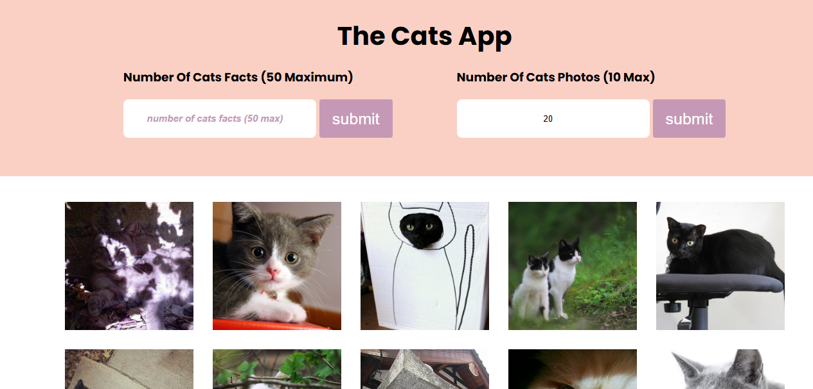

# The Cats Facts



A lightweight web application that allows users to fetch random cat facts and cat photos using public APIs. Built using vanilla JavaScript with Axios and styled using custom CSS.

---

## Features

- Fetches up to 50 random cat facts.
- Fetches a user-defined number of cat photos.
- Displays a loading indicator during API requests.
- Clean, minimal, and responsive interface.

---

## Technologies Used

- JavaScript (ES6+)
- HTML & CSS
- Axios for HTTP requests
- Font Awesome (for icons)
- Public APIs:
  - [meowfacts.herokuapp.com](https://meowfacts.herokuapp.com/)
  - [thecatapi.com](https://thecatapi.com/)

---

## Getting Started

Follow these steps to set up and run the project locally.

### 1. Clone the Repository

```bash
git clone https://github.com/Anthony-muhoro/the-cat.git
cd the-cat
```

### 2. Install Dependencies

```bash
npm install
```

### 3. Spin up the project

```bash
npm run dev
```
